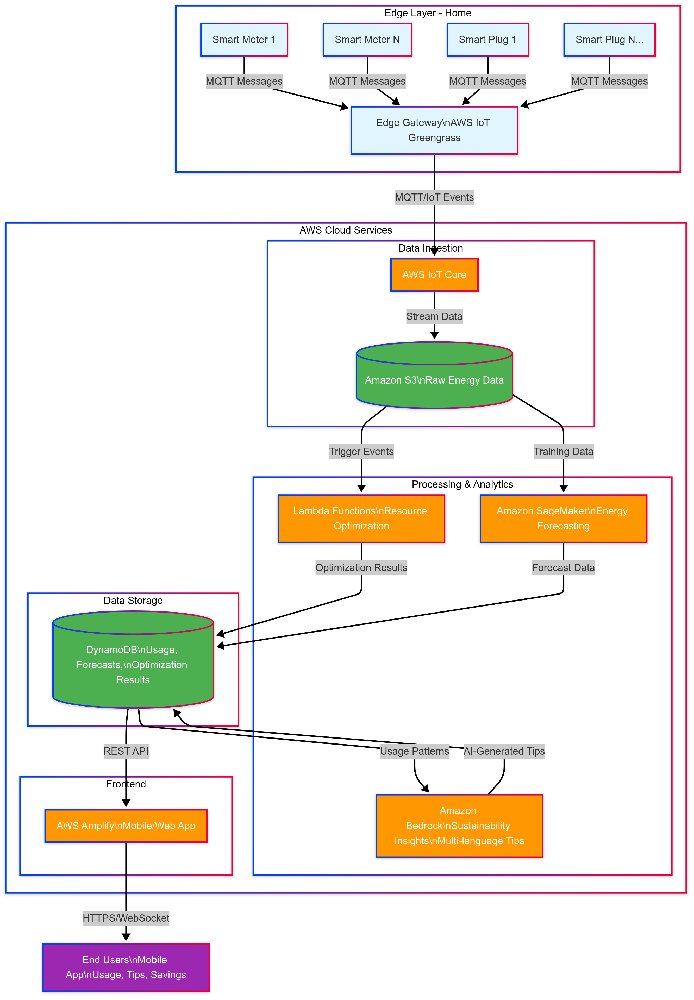

# 🌿 GreenGrid AI

**AI-powered neighborhood energy orchestration for equitable, sustainable power in Missouri**

---

## 📌 Problem

Missouri’s suburban and urban neighborhoods face high utility costs, aging grid infrastructure, and a lack of accessible tools for residents to manage usage - challenges that hit linguistically diverse and low-income communities hardest.

- In St. Louis City alone, ~20,000 households spend **6%–30%** of income on utilities.
- Peak loads strain the grid due to limited local coordination.

**GreenGrid AI** addresses this by forecasting household energy demand, balancing neighborhood loads, and providing personalized, multilingual sustainability guidance.

---

## 💡 Solution

GreenGrid AI combines **IoT edge devices**, **cloud-based ML**, and **Generative AI** to empower households and neighborhoods:

- ✅ **IoT Edge** - Simulated smart meters using **AWS IoT Greengrass**
- ✅ **Machine Learning** - **Amazon SageMaker** predicts next-day usage
- ✅ **Generative AI** - **Amazon Bedrock** crafts personalized, multilingual tips
- ✅ **Frontend App** - **AWS Amplify** shows real-time usage, forecasts, and recommended actions

---

## ⚙️ Architecture



---

## 🎥 Demo

- 👉 [Watch the demo video on YouTube](https://www.youtube.com/watch?v=DHTxfkB2HR8&feature=youtu.be)
- 📃 [Project Notion page](https://www.notion.so/GeenGrid-212b2f6a587d8061a859ed697f4ab5d6?source=copy_link)

---

## 📂 Project Structure

Root/
│
├── .vscode/ # VSCode configs
├── amplify/ # Amplify deployment configs
│ ├── .config/
│ ├── backend/
│ │ ├── auth/greengrid73fa1012
│ │ ├── function/greengridforecastfunction
│ │ ├── types/
│ │ ├── backend-config.json
│ │ ├── tags.json
│ ├── hooks/
│ ├── cli.json
│ ├── team-provider-info.json
│
├── docs/ # Diagrams, slides
│ ├── architecture.mmd
│
├── greengrid-frontend/ # React frontend
│ ├── amplify/
│ ├── .config/
│ ├── hooks/
│ ├── public/
│ ├── src/ # React source (App.js etc.)
│ ├── .amplifyignore
│ ├── .gitignore
│ ├── README.md
│ ├── package.json
│ ├── package-lock.json
│
├── notebooks/ # Jupyter notebooks for SageMaker
│ ├── greengrid_energy_insights.ipynb
│
├── scripts/ # Python helper scripts
│
├── src/ # Backend Python scripts
│ ├── init.py
│ ├── check_aws.py
│ ├── dynamo_utils.py
│ ├── lambda_function.py
│ ├── main_pipeline.py
│ ├── simulate_neighborhood.py
│ ├── test_lambda.py
│ ├── requirements.txt
│
├── tests/ # Unit tests
├── .gitignore
├── README.md # This file
├── requirements.txt # Python dependencies
├── package.json / lock # Node dependencies (if any)


---

## 🚀 How to Run Locally

Clone the repository:

```bash
git clone https://github.com/Hereforlolz/GreenGrid.git
cd GreenGrid

Install Python dependencies:

pip install -r requirements.txt

Run local test scripts (example: forecast notebook):

jupyter notebook notebooks/greengrid_energy_insights.ipynb

Deploy frontend (optional):

cd greengrid-frontend
npm install
npm start

📈 Future Work

    🔄 Connect live data streams to frontend and improve UX

    🔄 Integrate with real smart plugs and pilot with households

🙌 Author

SreeNidhi (Solo Builder)
🏆 License

MIT - Open for learning and impact.